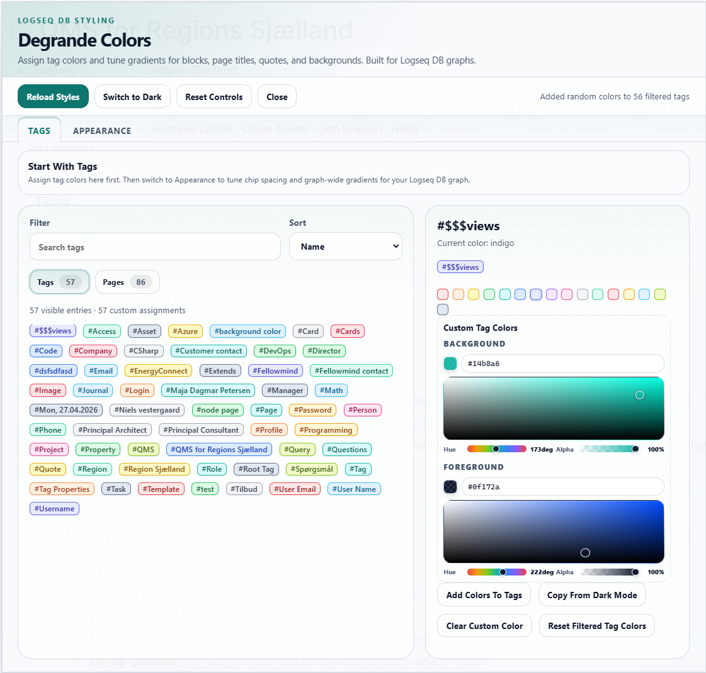
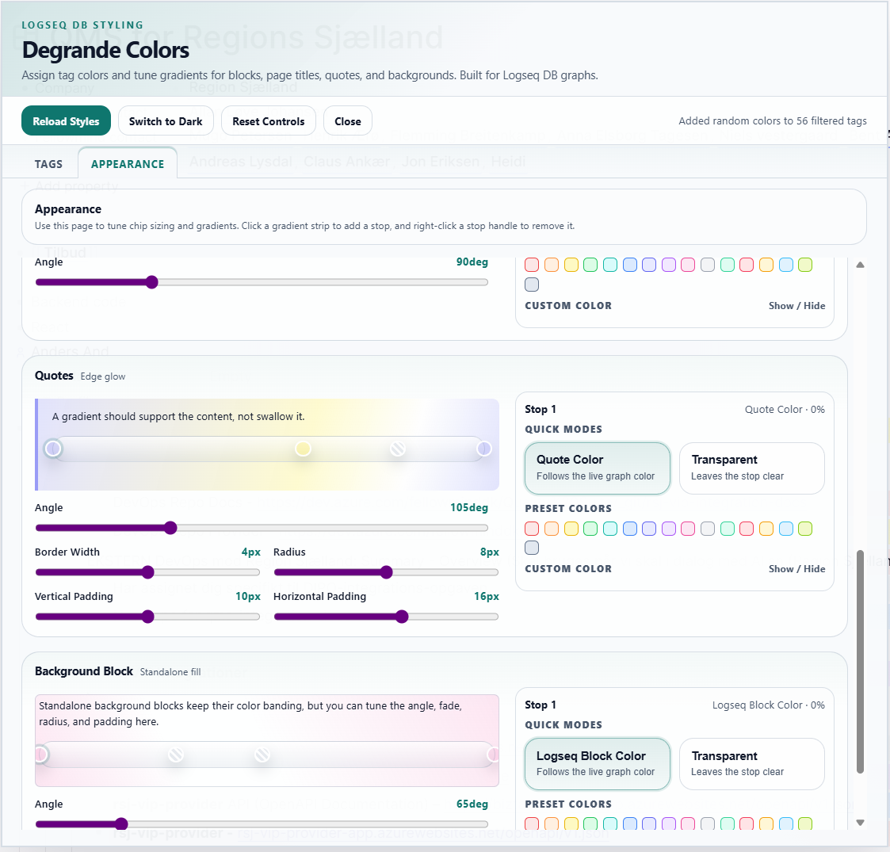

# Degrande Colors

Degrande Colors is a styling panel for Logseq DB graphs. It makes it easier to assign tag colors, tune chip styling, and adjust live gradients for blocks, page titles, quotes, and colored background blocks from one place.

> This plugin has currently been tested on Logseq DB only.

## Screenshots

### Tags

### Appearance

## Highlights

- Assign preset or custom colors to tags from an in-app control panel.
- Apply live gradients to tagged blocks and page titles.
- Tune quote blocks, background blocks, and tag chip presentation.
- Filter and sort tags while you work through larger graphs.
- Keep styling choices saved in plugin state between sessions.

## What It Styles

- Tag chips
- Tagged blocks
- Page titles
- Quotes
- Colored background blocks

## Logseq DB Scope

Degrande Colors is built for Logseq DB graphs and has only been verified there so far. If you use another Logseq graph mode, treat support there as unconfirmed until it has been tested separately.

## Load Unpacked Plugin

1. Open Logseq Desktop.
2. Enable Developer mode.
3. Open the Plugins dashboard.
4. Choose `Load unpacked plugin`.
5. Select the repository root.
