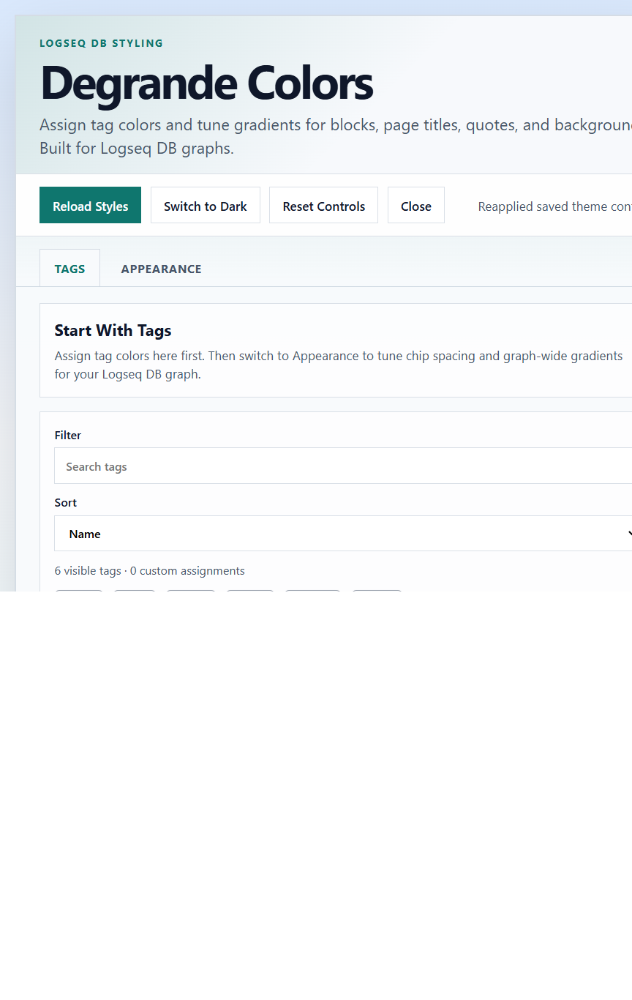

# Degrande Colors

Degrande Colors is a Logseq plugin for DB graphs. It lets you assign tag colors, tune inline tag chip styling, and adjust live gradients for tagged blocks, page titles, quotes, and colored background blocks.

## What It Does

- Adds per-tag color assignments with preset and custom colors.
- Applies live gradients to tagged blocks and page titles.
- Tunes quote and background block styling from an in-app control panel.
- Stores styling choices in plugin state so they persist between sessions.

## Logseq DB Scope

This plugin is built for Logseq DB graphs.

## Repo Layout

- `logseq-db-degrande-colors/`: the actual Logseq plugin package.
- `.github/workflows/publish.yml`: packages the plugin subdirectory and attaches a release zip on version tags.

## Load Unpacked Plugin

1. Open Logseq Desktop.
2. Enable Developer mode.
3. Open the Plugins dashboard.
4. Choose `Load unpacked plugin`.
5. Select `logseq-db-degrande-colors/`.

## Release Flow

1. Push a tag like `v0.1.0`.
2. GitHub Actions packages the plugin files from `logseq-db-degrande-colors/`.
3. The workflow creates or updates a GitHub release and attaches a zip that is ready for Logseq marketplace submission.

## Marketplace Submission

The Logseq marketplace submission is made through a PR to `logseq/marketplace` with a `manifest.json` entry that points to this public GitHub repository.